# TC流量控制

## 1实验拓扑
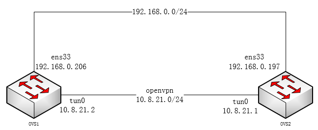

## 2实验一

### 2.1实验需求
- 流量可以通过公网网段192.168.0.0/24网段通信
- ovs1与ovs2之间通过openvpn打隧道后，流量可以通过ovs1的openvpn隧道到ovs2
- 分别用iperf测试走公网网段、openvpn隧道的udp、tcp带宽
- 通过wondersharper在ovs1的出口上进行流量限制

### 2.2实验过程

#### 2.2.1配openvpn隧道
- 搭建openvpn隧道，ovs2作为openvpn server端，配置server.conf

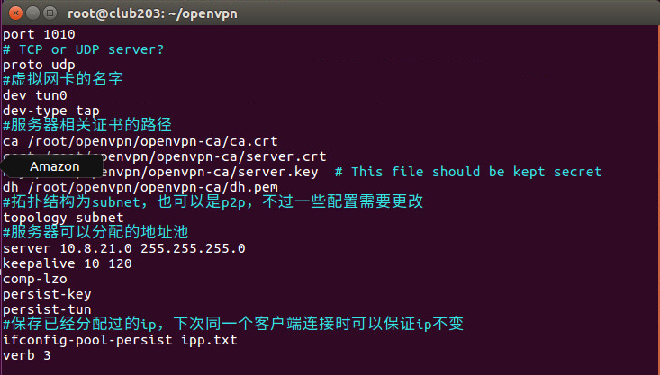

- ovs2启动openvpn server，启动后会多出来一个虚拟网卡tun0

```
openvpn --config server.conf
```

- ovs1作为openvpn client端，配置client.conf

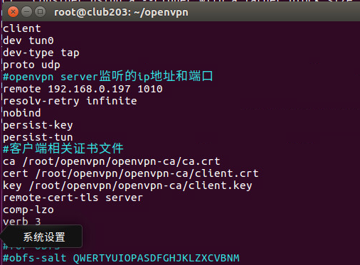

- ovs1启动openvpn client

```
openvpn --config client.conf
```

- ovs1启动openvpn client，启动后会多出来一个虚拟网卡tun0
- 此时ovs1-ovs2便可以通过openvpn ip进行通信了

### 2.2.2iperf测试公网带宽
#### 2.2.2.1iperf测试公网192.168.0.0/24网段带宽

- 在ovs2上开启iperf udp server

```
iperf -s -u -p 12345 -i 1
```

- 在ovs1上开启iperf udp client，以1000Mbit/s发送

```
iperf -c 192.168.0.197 -p 12345 -i 1 -t 20 -b 1000M
```

- 可以看到公网udp瓶颈带宽不超过500Mbit/s

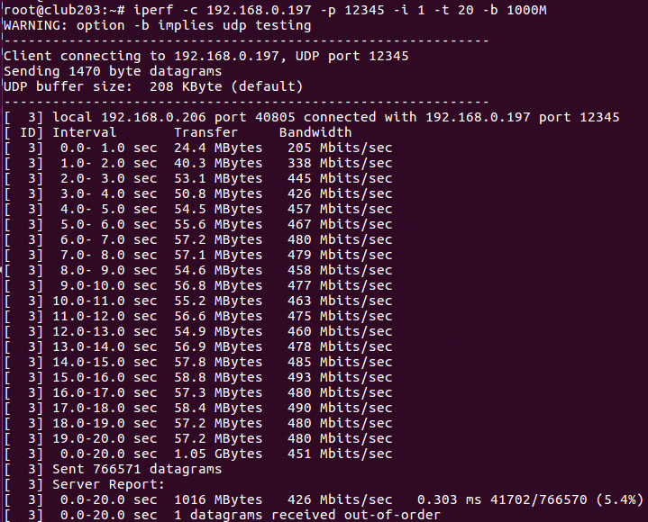

- 在ovs2上开启iperf tcp server

```
iperf -p 12345 -i 1
```

- 在ovs1上开启iperf tcp client

```
iperf -c 192.168.0.197 -p 12345 -i 1 -t 20 -M
```

- 可以看公网tcp到瓶颈带宽在2Gbit/s左右

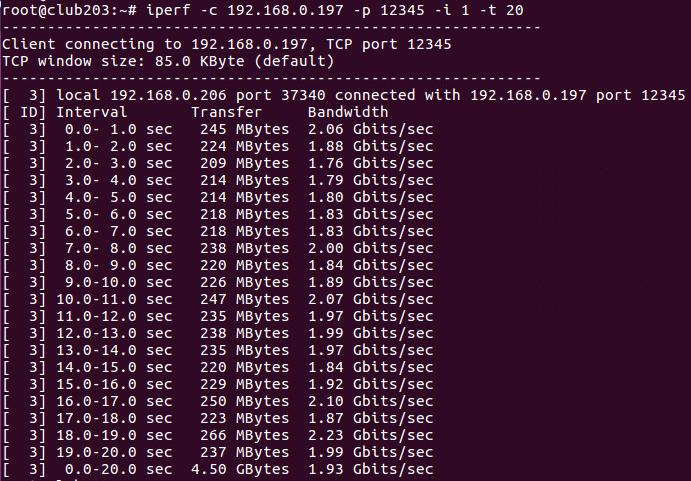


#### 2.2.2.2iperf测试openvpn隧道10.8.21.0/24网段带宽

- 可以看到openvpn隧道udp瓶颈带宽在800Mbit/s左右

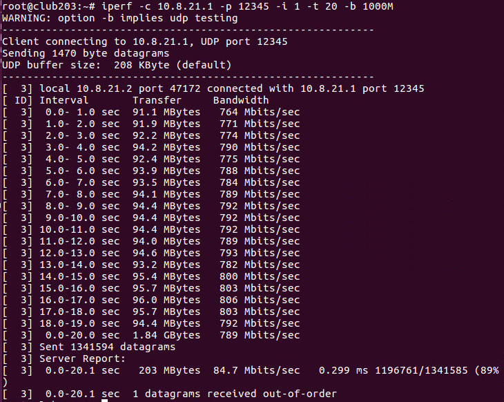


- 可以看openvpn隧道tcp到瓶颈带宽在80Mbit/s左右

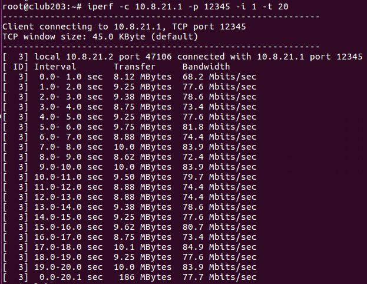

### 2.2.3通过wondersharper在ovs1上进行流量限制

- 比如执行如下命令，将ovs1的出口带宽限制为下行2Gbit/s、上行100Mbit/s

```
wondersharper ens33 2000000 100000
```

- 再进行公网网卡udp测试，速度被限制在100Mbit/s


- 公网网卡tcp测试，速度被限制在100Mbit/s

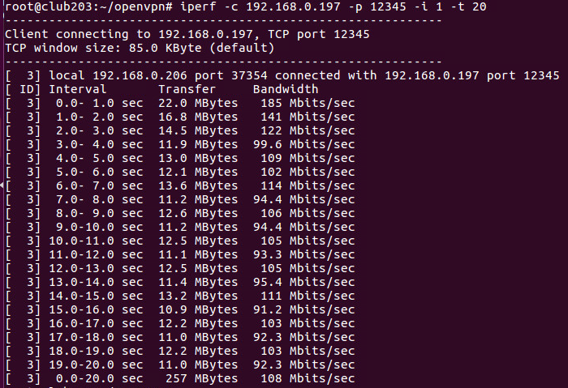


## 3实验二

### 3.1实验需求
- 根据实验一搭的环境
- 在ovs1和ovs2之间用iperf根据不同的端口号开启两个udp流
- 在ovs1出口网卡下tc策略，进行流量控制
- 观察通过公网和隧道两种方式的流量是否按tc策略被限制

### 3.2实验过程
#### 3.2.1在ovs2开两个iperf udp server，分别监听12345端口、12346端口

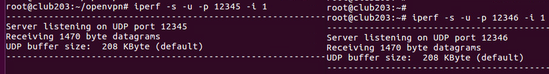

#### 3.2.2在ovs1上下tc策略，端口号12345限流100Mbps，端口号12346限流20Mbps


##### 在公网网卡ens33上建立tc qdisc htb队列
tc qdisc add dev ens33 root handle 1: htb default 11

##### 添加分类，限速100Mbps，优先级为1（最高）
tc class add dev ens33 parent 1: classid 1:11 htb rate 100mbit ceil 100mbit prio 1
##### 添加分类，限速20Mbps，优先级为2
tc class add dev ens33 parent 1: classid 1:12 htb rate 20mbit ceil 20mbit prio 2

##### 添加过滤器，用u32匹配器的端口号进行匹配，端口号12345分给100Mbps，端口号12346分给20Mbps类
tc filter add dev ens33 protocol ip parent 1:0 prio 1 u32 match ip dport 12345 0xffff flowid 1:11
tc filter add dev ens33 protocol ip parent 1:0 prio 1 u32 match ip dport 12346 0xffff flowid 1:12


#### 3.2.3在ovs1上启动两个iperf udp client观察效果

- 公网192.168.0.0/网段通信的流量，是可以成功被限速的；比如12345端口打150Mbps的流量，12346端口打80Mbps的流量，结果如下

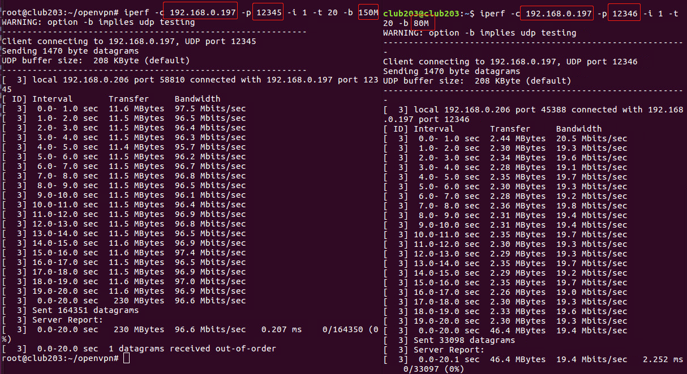

- 虽然openvpn的网卡tun0是虚拟网卡，但在物理网卡ens33上tc限速后，对从openvpn隧道走的流量不产生效果，如下图

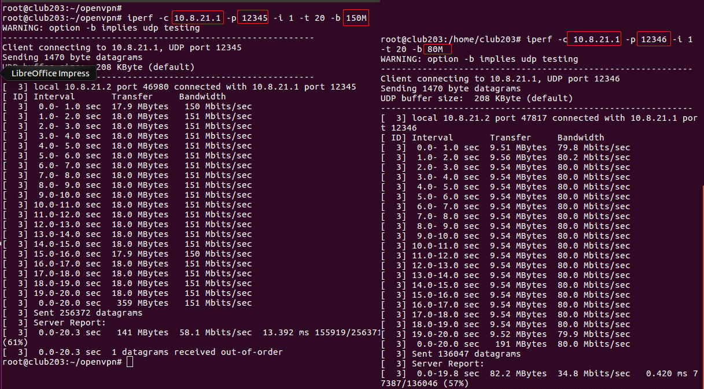

- 调整tc策略，端口号12345限流300Mbps，端口号12346限流200Mbps，对openvpn仍无效

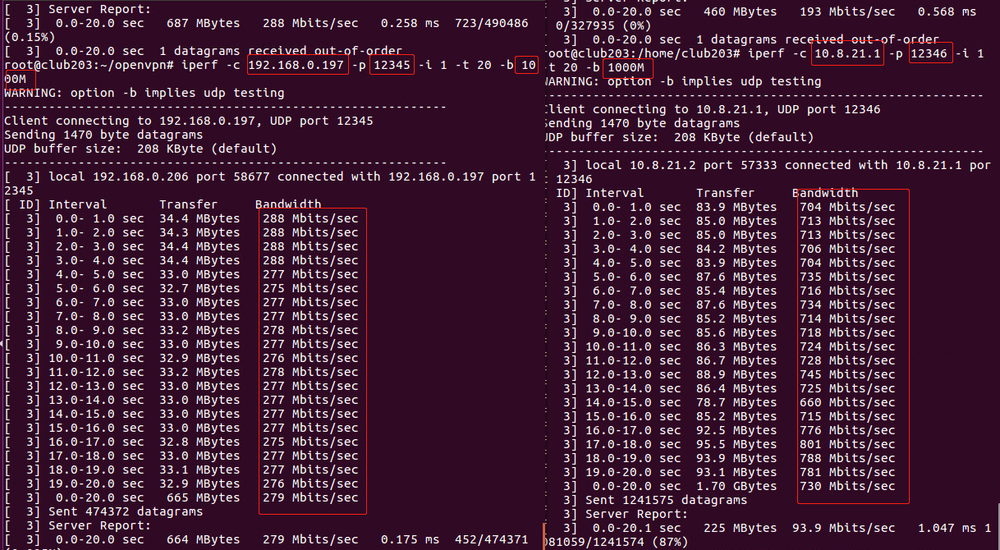